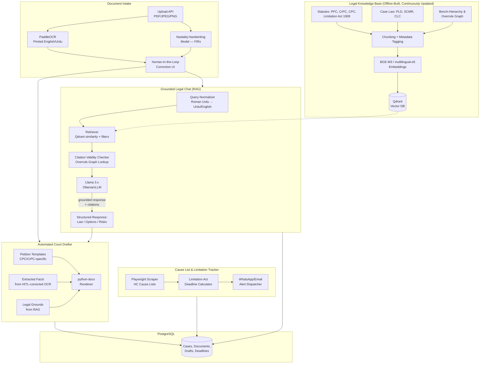
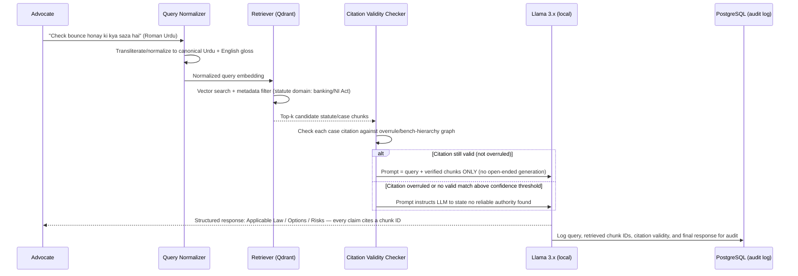
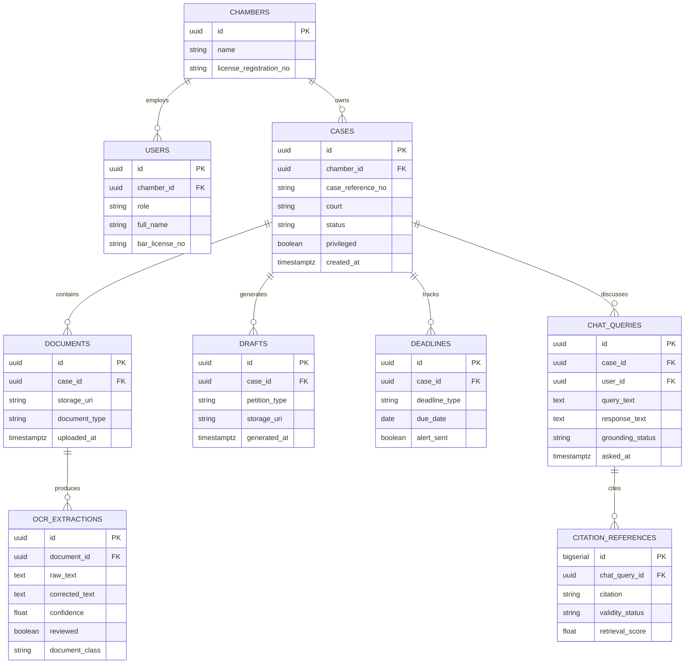
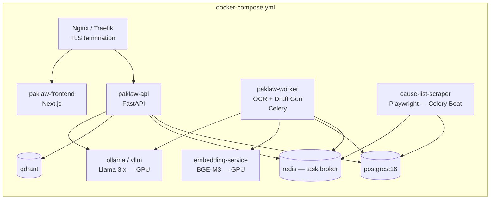
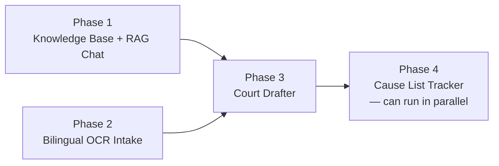

# PakLaw-AI Assistant: Bilingual Legal Intelligence Platform for Pakistani Advocates
### Technical Design & Architecture Specification

**Document Version:** 1.0
**Status:** Draft — Architecture Review
**Backend Language:** Python (mandatory)
**LLM/Embedding Strategy:** Open-source, self-hosted models (no third-party API dependency for legal content processin

## 1. Product Requirements Document (PRD)

### 1.1 Problem Statement

Pakistani legal practice runs on four structural inefficiencies that this platform directly targets:

1. **Document & evidence chaos.** Case-critical facts live in low-quality photocopies (*Naqal*), hand-written FIRs, and dense Patwari land records — mixing formal English with hand-written Nastaliq Urdu script. Manual extraction is slow and error-prone.
2. **Time-consuming precedent research.** Advocates manually search hardcopy citation indexes (PLD, SCMR, CLC), and junior lawyers frequently cite rulings that have since been overruled by a larger bench, without realizing it.
3. **Inefficient drafting workflows.** Every petition under the CPC/CrPC is hand-typed from scratch — headers, party blocks, and Prayer clauses — creating repetitive work and procedural formatting errors that courts can reject outright.
4. **Fragmented case tracking.** Hearing dates (*Tareekh*) are tracked by manually checking physical notice boards or scattered cause lists; a missed date can produce a costly ex-parte dismissal.

PakLaw-AI is a secure, bilingual (English/Urdu) SaaS platform that automates document intake, grounds all legal Q&A strictly in verified Pakistani statutes and case law (eliminating hallucinated citations), auto-drafts court-ready petitions, and tracks filing deadlines against the Limitation Act 1908.

### 1.2 User Personas

| Persona | Primary Need |
|---|---|
| Senior Advocate (High Court) | Fast, verified PLD/SCMR citation lookup; rapid summarization of voluminous multi-year case files. |
| Junior Associate / Chamber Lawyer | Step-by-step strategic guidance and automated Urdu drafting (*Arzi Dawa*). |

### 1.3 Functional Requirements

| Feature | Requirements |
|---|---|
| **F1 — Hybrid Bilingual OCR & Intake** | Accept PDF/JPEG/PNG up to 50MB; extract text from low-resolution hand-written Urdu (FIRs) and formal English orders; produce a 1-page summary (parties, applicable PPC/CrPC sections, chronological event table). |
| **F2 — Legal Consultation Chat** | Accept English, Urdu script, and Roman Urdu prompts; every response structured as *Applicable Law → Actionable Options → Opposing Risks*; every legal claim carries a clickable, verifiable statute citation. |
| **F3 — Automated Court Drafter** | Templates for standard petitions (§497 CrPC Bail, Order 39 Rules 1&2 CPC Stay, Article 199 Writ); auto-populated Court Header, Parties Block, Facts, Legal Grounds, Prayer (*Estegaza*); export to editable `.docx`. |
| **F4 — Cause List & Limitation Tracker** | Scrape daily High Court cause lists by lawyer name/license; compute Limitation Act 1908 deadlines; send WhatsApp/email alerts 48 hours before a filing window closes. |

### 1.4 Non-Functional Requirements

| Category | Requirement |
|---|---|
| Security | AES-256 at rest, TLS 1.3 in transit; zero-retention guarantee — no client document or query is ever used to train any model. |
| Localization/Performance | RAG pipeline queries a dedicated, locally-hosted vector database containing only Pakistani statutes and judgments; chat response time < 4s (p95). |
| Model hosting | Self-hosted, open-source LLM and embedding stack — no client legal content is transmitted to a third-party inference API, which is both a privacy requirement (attorney-client privilege) and a direct enabler of the zero-retention guarantee. |

### 1.5 Success Metrics (KPIs)

| Metric | Target |
|---|---|
| Monthly Active Users (registered chambers) | ≥ 60% retention |
| Time to produce a court-ready petition | < 15 minutes (from PRD goal of 6 hours → 10 minutes for document review specifically) |
| Hallucinated/fabricated citation rate | **Zero** during beta — this is a hard gate, not a soft target |
| OCR-to-usable-summary time | < 10 minutes per document set |
| Chat grounding coverage | 100% of legal claims in a chat response carry a verifiable, clickable statute/citation link, or the system explicitly declines to answer |

---

## 2. System Architecture & Technical Stack

### 2.1 Technology Stack (Python-First, Fully Self-Hostable)

| Layer | Technology | Justification |
|---|---|---|
| Backend API | FastAPI (async) | Native async support for OCR/LLM job orchestration; strong typing via Pydantic for the many structured legal payloads this system handles. |
| Task orchestration | Celery + Redis (broker) | OCR and LLM inference are long-running, resource-heavy jobs that must not block the API process. |
| LLM serving | **Ollama** or **vLLM** serving a quantized **Llama 3.x** (8B/70B, INT4/INT8 GGUF or AWQ) | Fully self-hosted — satisfies the zero-retention/no-third-party-API requirement directly; vLLM preferred at higher concurrency for its continuous-batching throughput advantage over Ollama. |
| Embedding model | **BGE-M3** or **intfloat/multilingual-e5-large** (self-hosted via `sentence-transformers`) | Both support Urdu and English in the same embedding space and English-Urdu cross-lingual retrieval, which is essential since queries may arrive in Roman Urdu, Urdu script, or English against a mixed-language statute corpus. |
| Vector database | **Qdrant** (self-hosted) | Production-grade filtering (by court level, statute, year, bench size) alongside vector search — needed for the precedent-validity logic in §3.2, which plain similarity search alone can't express. |
| Bilingual OCR | **PaddleOCR** (Urdu-capable branch) as primary; specialized Urdu-Nastaliq model (e.g., a fine-tuned TrOCR/UTRNet-style model) as a secondary pass for hand-written FIRs | See §3.1 — hand-written Nastaliq OCR is a genuinely hard, unsolved-at-100%-accuracy problem; the architecture assumes a human-in-the-loop correction step rather than blind trust in OCR output. |
| Relational persistence | PostgreSQL (SQLAlchemy ORM) | Cases, documents, drafts, deadlines, citation-validity records. |
| Docx generation | `python-docx` | Native `.docx` output for FR-3.3, editable in MS Word as required. |
| Cause-list scraping | Playwright (headless) + scheduled Celery Beat jobs | High Court cause-list pages are often JS-rendered; Playwright handles this more reliably than a plain HTTP scraper. |
| Notifications | Twilio WhatsApp Business API / SMTP | The one external, non-legal-content dependency — notification payloads are deadline metadata only (see §4.3), never case content. |
| Frontend | Next.js + TailwindCSS, RTL-aware layout for Urdu | Bilingual UI must correctly handle right-to-left Urdu script alongside LTR English/legal-citation text in the same document view. |
| Containerization | Docker + Docker Compose (GPU-enabled base image for the LLM/embedding/OCR services) | Reproducible builds; GPU passthrough required for acceptable LLM/OCR latency at the stated < 4s target. |

### 2.2 Component Architecture



### 2.3 Grounded Chat Query Flow (Hallucination-Prevention Path)



### 2.4 Architectural Rationale

- **The LLM never answers from parametric memory alone.** The prompt template explicitly restricts the model to synthesizing an answer *only* from the retrieved, validity-checked chunks passed to it in context — this is the direct architectural mechanism behind the PRD's "zero hallucinated citations" gate, not just a prompting hope. If retrieval returns nothing above a confidence threshold, the system is instructed to say so rather than generate a plausible-sounding but unverified citation.
- **Citation validity is a graph lookup, not a similarity score.** Whether a precedent is still good law depends on whether a *later, higher-authority* bench overruled it — a relationship a vector-similarity search cannot express on its own. This is why the knowledge base maintains a separate bench-hierarchy/overrule graph (§3.2) consulted after retrieval and before the chunk is ever shown to the LLM.
- **OCR output is never trusted blindly for legal drafting.** Hand-written Nastaliq FIR text feeds into a human-in-the-loop correction step before any extracted fact is used to populate a court filing — an uncorrected OCR error in a Facts paragraph is a materially different risk than an uncorrected OCR error in an internal search index.
- **All model inference stays inside the organization's own infrastructure.** Every AI-processing component (OCR, embeddings, LLM) is self-hosted specifically so that NFR-1.2 (zero third-party training use) is structurally true rather than dependent on a vendor's data-use policy.

---

## 3. Deep-Dive Technical Implementation

### 3.1 Hybrid Bilingual OCR Pipeline (Nastaliq + Printed English)

**Why this is hard:** Nastaliq is a cursive, context-dependent script where letterforms change based on position in a word — it does not decompose into fixed-width glyphs the way Latin-script OCR assumes, and hand-written FIRs add inconsistent handwriting on top of that. Off-the-shelf OCR (including generic Tesseract Urdu packs) performs poorly on this combination; treating OCR output as ground truth for legal filings would be a serious defect, not a minor imperfection.

**Pipeline design:**

```python
from dataclasses import dataclass
from enum import Enum

class DocumentClass(str, Enum):
    PRINTED_ENGLISH = "printed_english"
    PRINTED_URDU = "printed_urdu"
    HANDWRITTEN_URDU = "handwritten_urdu"   # FIRs, Patwari annotations

@dataclass
class OCRResult:
    text: str
    confidence: float
    bbox: tuple[int, int, int, int]
    document_class: DocumentClass
    needs_review: bool   # True if confidence < review_threshold

def route_and_extract(page_image, review_threshold: float = 0.85) -> list[OCRResult]:
    doc_class = classify_document_region(page_image)  # lightweight CNN classifier

    if doc_class == DocumentClass.HANDWRITTEN_URDU:
        # Specialized Nastaliq handwriting model — lower expected confidence baseline
        raw_results = nastaliq_handwriting_model.predict(page_image)
        threshold = review_threshold + 0.05  # stricter gate for handwriting
    else:
        # PaddleOCR handles printed Urdu and English well
        raw_results = paddle_ocr_engine.ocr(page_image, cls=True)
        threshold = review_threshold

    return [
        OCRResult(
            text=r.text, confidence=r.confidence, bbox=r.bbox,
            document_class=doc_class,
            needs_review=r.confidence < threshold,
        )
        for r in raw_results
    ]
```

**Production hardening:**

- **Confidence-gated human review, not full manual re-typing.** Only spans below the confidence threshold are surfaced to a reviewer in the correction UI — this keeps the "6 hours → 10 minutes" goal realistic by not forcing a full manual re-transcription of every document, while still preventing low-confidence guesses from silently entering a legal draft.
- **Two-stage routing.** A lightweight upstream classifier (printed vs. handwritten, Urdu vs. English region) routes each page region to the appropriate specialized model, since a single OCR engine tuned for printed text will systematically underperform on hand-written FIR content and vice versa.
- **Structured extraction, not just raw text.** For FIRs and court orders, the summary generation step (FR-1.3) runs a second, template-aware pass over the corrected OCR text to pull out parties, applicable PPC/CrPC sections, and a chronological event table — this is a separate structured-extraction step, not something inferred directly from raw OCR text by the drafting engine.

### 3.2 Zero-Hallucination Grounded RAG with Precedent-Validity Checking

This is the platform's core differentiator and its hardest correctness requirement: the PRD's success metric is **zero** fabricated citations, not "low."

**Bench-hierarchy / overrule graph.** Pakistani case law has a strict authority hierarchy (Supreme Court full bench > Supreme Court division bench > High Court full bench > High Court division bench, etc.). The knowledge base maintains this as an explicit graph, separate from the vector index:

```python
from dataclasses import dataclass

@dataclass
class CaseNode:
    citation: str          # e.g. "PLD 2019 SC 445"
    bench_type: str        # "SC_FULL", "SC_DIVISION", "HC_FULL", "HC_DIVISION"
    status: str            # "GOOD_LAW", "OVERRULED", "DISTINGUISHED"
    overruled_by: str | None   # citation of the overruling case, if any

def is_citable(case: CaseNode) -> tuple[bool, str]:
    if case.status == "OVERRULED":
        return False, f"Overruled by {case.overruled_by} — do not cite as current authority"
    if case.status == "DISTINGUISHED":
        return True, "Valid but distinguished in later rulings — cite with caution flag"
    return True, "Good law"
```

**Retrieval-to-generation contract:**

```python
def answer_legal_query(query: str, top_k: int = 5, min_score: float = 0.72) -> dict:
    normalized = normalize_query(query)  # Roman Urdu → canonical form
    candidates = qdrant_client.search(
        collection_name="pakistani_law",
        query_vector=embed(normalized),
        limit=top_k,
        score_threshold=min_score,
    )

    if not candidates:
        return {"answer": None, "reason": "NO_RELIABLE_AUTHORITY_FOUND"}

    verified_chunks = []
    for c in candidates:
        if c.payload["type"] == "case_law":
            citable, note = is_citable(get_case_node(c.payload["citation"]))
            if not citable:
                continue  # never pass an overruled case into the LLM's context
        verified_chunks.append(c)

    if not verified_chunks:
        return {"answer": None, "reason": "ONLY_OVERRULED_AUTHORITY_AVAILABLE"}

    prompt = build_grounded_prompt(query=normalized, chunks=verified_chunks)
    response = llm_client.generate(prompt, temperature=0.1)  # low temperature — factual synthesis, not creative
    return {
        "answer": response,
        "citations": [c.payload["citation"] for c in verified_chunks],
        "reason": "GROUNDED",
    }
```

**Key design decisions:**

- **Overruled cases are filtered out *before* they ever enter the LLM's context window** — not after generation. This closes off an entire failure mode where the model might cite a retrieved-but-invalid precedent because it was present in context, regardless of instruction-following.
- **Low temperature (0.1) generation** for legal synthesis — this is factual grounding, not creative writing; low temperature reduces the model's tendency to embellish beyond what the provided chunks actually support.
- **Roman Urdu normalization is a distinct pipeline stage**, not something left to the embedding model alone. Roman Urdu spelling is highly non-standardized ("bounce honay," "bounce hona," "bounce ho jana" for the same concept), so a transliteration/normalization step before embedding materially improves retrieval recall versus relying on the embedding model to generalize across arbitrary romanization variants.
- **Every response is logged with its retrieved chunk IDs and citation-validity outcome** (§2.3), which is what makes the "zero hallucination" KPI *auditable* during beta rather than just self-reported.
- **Knowledge base freshness is an operational process, not a one-time load.** New judgments and legislative amendments must be ingested and the overrule graph updated on an ongoing basis — this pipeline should run as a scheduled Celery job with a clear editorial/verification step before new content is promoted into the production Qdrant collection, since an unvetted ingestion pipeline could itself introduce bad data into a system whose entire value proposition is trustworthiness.

### 3.3 Automated CPC/CrPC-Compliant Draft Generation Engine

```python
from docx import Document
from docx.shared import Pt

def generate_petition(petition_type: str, case_facts: dict, legal_grounds: list[dict]) -> Document:
    """
    Renders a court-ready .docx from a structured template, populated with
    HITL-corrected facts and RAG-sourced, citation-validated legal grounds.
    """
    template = load_template(petition_type)  # e.g. "CRPC_497_BAIL", "CPC_ORDER39_STAY"
    doc = Document()

    _render_court_header(doc, template.court_name_format, case_facts["court"])
    _render_parties_block(doc, case_facts["petitioner"], case_facts["respondent"])
    _render_facts_paragraphs(doc, case_facts["chronological_events"])

    grounds_section = doc.add_heading("LEGAL GROUNDS", level=2)
    for ground in legal_grounds:
        p = doc.add_paragraph(ground["text"])
        p.add_run(f" [{ground['citation']}]").italic = True  # inline, visible citation — never silently dropped

    _render_prayer_clause(doc, template.prayer_template, case_facts)
    return doc
```

**Design notes:**

- **Templates encode jurisdiction-specific structure, not just boilerplate text.** Court name formatting, party-description conventions, and the Prayer (*Estegaza*) clause structure differ by petition type and forum — these are modeled as distinct, versioned templates (`CRPC_497_BAIL`, `CPC_ORDER39_STAY`, `ART199_WRIT`, etc.) rather than one generic template with find-and-replace, since procedural formatting mistakes are a stated cause of court rejection in the PRD's problem statement.
- **Every inserted legal ground carries its citation inline in the generated document**, not just in an internal audit log — this keeps the drafting engine's output independently verifiable by the advocate before filing, consistent with the platform's grounding-first design philosophy.
- **Facts come only from HITL-corrected OCR output**, never directly from raw OCR — this is the same trust boundary established in §3.1, applied at the point where facts actually get committed into a legal filing.

---

## 4. Security & Data Privacy Measures

Legal documents are protected by attorney-client privilege and often contain highly sensitive personal, financial, and criminal-case data. This system's security posture is built around that reality, not treated as a generic SaaS checklist.

### 4.1 Encryption & Transport

- **AES-256 encryption at rest** for all uploaded documents, OCR output, drafts, and the PostgreSQL database (transparent data encryption or volume-level encryption, per NFR-1.1).
- **TLS 1.3 in transit** for all client-facing traffic; internal service-to-service traffic (API → Celery workers → Qdrant/Ollama) runs on an isolated internal network segment, not exposed publicly.
- **Self-hosted inference closes the biggest privacy gap.** Because OCR, embeddings, and the LLM all run on infrastructure the platform controls (§2.1), no case document or chat query is ever transmitted to a third-party API — this is what makes the zero-retention guarantee (NFR-1.2) structurally enforceable rather than contractually promised.

### 4.2 Access Control & Confidentiality Boundaries

- **Chamber/firm-level tenant isolation.** Every case, document, and draft is scoped to the owning law chamber; row-level access filters (not just API-layer checks) prevent one firm's data from being queryable by another, even under a compromised or misconfigured token.
- **Role separation.** `senior_advocate` (full case access, citation research, drafting), `junior_associate` (drafting and chat, scoped to assigned cases), and `admin` (chamber user management, no case-content access by default) — mirroring how access is actually structured within a law chamber.
- **Privileged-content flagging.** Documents can be marked attorney-client privileged at upload; privileged documents are excluded from any future bulk export or analytics feature by default, requiring an explicit, logged override.
- **Audit logging.** Every document view, chat query, and draft generation is logged (who, when, what case) — both for security accountability and because the RAG audit log described in §3.2 is itself the evidentiary basis for the "zero hallucination" claim.

### 4.3 Data Privacy Policy

- **Zero-retention for model training**, structurally guaranteed by self-hosting: the deployed Llama and embedding models are fixed-weight inference services, not continuously fine-tuned on client traffic — no client query or document is fed back into any training loop.
- **Notification payload minimization.** WhatsApp/email deadline alerts (FR-4.2) — the one feature with an unavoidable external dependency — contain only deadline metadata (case reference number, court, date) and never case facts, party names beyond what's necessary for the lawyer to identify the case, or document content.
- **Retention & deletion.** Client chambers control retention policy for their own case data; a chamber offboarding or a client matter closing triggers a scheduled, logged deletion pipeline covering documents, OCR intermediates, and derived drafts — but never the anonymized, aggregate query-pattern data used for the platform's own accuracy monitoring (§3.2's audit log is retained separately, stripped of document content, purely to support the hallucination-rate KPI).
- **Knowledge base content is public legal record, handled separately from client data.** Statutes and published judgments (PLD/SCMR/CLC) are public information and are not subject to the same client-confidentiality controls — but the platform's own citation-validity annotations (the overrule graph) are curated content that should be versioned and attributable, since an error there propagates into every future grounded answer.

### 4.4 API Authentication & Authorization

- **JWT-based auth** with short-lived access tokens and chamber-scoped claims (chamber ID embedded in the token, checked on every case-data query).
- **Rate limiting** on chat and drafting endpoints, tuned to normal single-advocate usage patterns — both to control self-hosted GPU inference load (a real cost constraint for local LLM serving) and to catch anomalous bulk-access patterns.
- **Document upload validation**: strict MIME-type sniffing and size caps (50MB per FR-1.1), with uploaded files scanned before being handed to any OCR or PDF-parsing library, given that malformed PDFs/images are a known exploit vector for document-processing pipelines.

---

## 5. Database & Data Models

### 5.1 PostgreSQL Schema



```sql
CREATE TABLE cases (
    id                   UUID PRIMARY KEY DEFAULT gen_random_uuid(),
    chamber_id           UUID NOT NULL REFERENCES chambers(id),
    case_reference_no    VARCHAR(128) NOT NULL,
    court                VARCHAR(128) NOT NULL,
    status               VARCHAR(32) NOT NULL DEFAULT 'ACTIVE',
    privileged           BOOLEAN NOT NULL DEFAULT true,
    created_at           TIMESTAMPTZ NOT NULL DEFAULT now(),
    UNIQUE (chamber_id, case_reference_no)
);

CREATE TABLE ocr_extractions (
    id               UUID PRIMARY KEY DEFAULT gen_random_uuid(),
    document_id      UUID NOT NULL REFERENCES documents(id) ON DELETE CASCADE,
    raw_text         TEXT NOT NULL,
    corrected_text   TEXT,                      -- NULL until human review completes
    confidence       REAL NOT NULL,
    reviewed         BOOLEAN NOT NULL DEFAULT false,
    document_class   VARCHAR(32) NOT NULL CHECK (
                        document_class IN ('printed_english','printed_urdu','handwritten_urdu')
                     )
);
-- Facts may only be pulled into a draft from reviewed extractions — enforced at the application layer,
-- and defensively re-checked here via a partial index used by the drafting service's query.
CREATE INDEX idx_ocr_reviewed ON ocr_extractions (document_id) WHERE reviewed = true;

CREATE TABLE deadlines (
    id               UUID PRIMARY KEY DEFAULT gen_random_uuid(),
    case_id          UUID NOT NULL REFERENCES cases(id) ON DELETE CASCADE,
    deadline_type    VARCHAR(64) NOT NULL,       -- e.g. 'LIMITATION_ACT_APPEAL_WINDOW'
    due_date         DATE NOT NULL,
    alert_sent       BOOLEAN NOT NULL DEFAULT false
);
CREATE INDEX idx_deadlines_upcoming ON deadlines (due_date) WHERE alert_sent = false;

CREATE TABLE chat_queries (
    id                UUID PRIMARY KEY DEFAULT gen_random_uuid(),
    case_id           UUID REFERENCES cases(id),
    user_id           UUID NOT NULL REFERENCES users(id),
    query_text        TEXT NOT NULL,
    response_text     TEXT,
    grounding_status  VARCHAR(32) NOT NULL CHECK (
                        grounding_status IN ('GROUNDED','NO_RELIABLE_AUTHORITY_FOUND','ONLY_OVERRULED_AUTHORITY_AVAILABLE')
                     ),
    asked_at          TIMESTAMPTZ NOT NULL DEFAULT now()
);

CREATE TABLE citation_references (
    id                BIGSERIAL PRIMARY KEY,
    chat_query_id     UUID NOT NULL REFERENCES chat_queries(id) ON DELETE CASCADE,
    citation          VARCHAR(128) NOT NULL,
    validity_status   VARCHAR(32) NOT NULL,       -- 'GOOD_LAW', 'DISTINGUISHED'
    retrieval_score   REAL NOT NULL
);
```

### 5.2 Qdrant Schema (Legal Knowledge Base)

| Collection | Payload Fields | Purpose |
|---|---|---|
| `pakistani_law` | `text`, `citation`, `type` (`statute`/`case_law`), `bench_type`, `status`, `overruled_by`, `court`, `year`, `language` | Primary retrieval index; `bench_type`/`status` fields enable the metadata pre-filtering that the citation-validity checker (§3.2) relies on before even reaching the graph lookup. |

Separate from the vector payload, the **overrule graph itself is stored relationally in PostgreSQL** (a `case_relations` table of `citation → overruled_by → effective_date`), not inside Qdrant — this keeps the authority-hierarchy logic auditable and independently versioned from the embedding index, which matters when a knowledge-base update needs to be reviewed before promotion (§3.2).

---

## 6. DevOps, Docker & Deployment

### 6.1 Container Topology



Model-serving (`LLMSVC`, `EMBSVC`) and OCR-heavy processing (`WORKER`) are isolated into GPU-backed containers separate from the lightweight API process — the same rationale as previous system designs: a backlog of document processing or LLM inference should never degrade the responsiveness of the case-management API or the frontend.

```dockerfile
# backend/worker.Dockerfile — illustrative
FROM python:3.11-slim AS builder
WORKDIR /app
RUN apt-get update && apt-get install -y --no-install-recommends libgl1 poppler-utils && rm -rf /var/lib/apt/lists/*
COPY requirements.txt .
RUN pip install --no-cache-dir --user -r requirements.txt

FROM python:3.11-slim
WORKDIR /app
RUN apt-get update && apt-get install -y --no-install-recommends libgl1 poppler-utils && rm -rf /var/lib/apt/lists/*
COPY --from=builder /root/.local /root/.local
COPY . .
ENV PATH=/root/.local/bin:$PATH PYTHONUNBUFFERED=1
RUN useradd --create-home paklawworker && chown -R paklawworker /app
USER paklawworker
HEALTHCHECK --interval=30s --timeout=10s --start-period=60s --retries=3 \
    CMD celery -A app.worker inspect ping -d celery@$HOSTNAME || exit 1
CMD ["celery", "-A", "app.worker", "worker", "--loglevel=info", "--concurrency=2"]
```

### 6.2 Health-Check Strategy

| Check | Mechanism | Validates |
|---|---|---|
| API liveness/readiness | `GET /healthz` / `GET /readyz` | Process up; Postgres, Qdrant, and Redis reachable. |
| LLM service readiness | `GET /api/tags` (Ollama) or `/health` (vLLM) | Model is loaded and able to serve inference — the chat endpoint should itself return a clear "model unavailable" state rather than hanging toward the 4s SLA on failure. |
| Worker liveness | `celery inspect ping` | OCR/drafting worker consuming from the queue. |
| Knowledge-base freshness check | Scheduled internal metric comparing Qdrant last-ingest timestamp against a staleness threshold | Surfaces (as an alert, not an outage) if statute/case-law ingestion has silently stalled — directly relevant to the platform's core trust claim. |

### 6.3 Resource Allocation & Observability

| Component | CPU (request/limit) | Memory | GPU | Notes |
|---|---|---|---|---|
| API | 1 / 2 vCPU | 512Mi / 1Gi | — | No inference in this process. |
| LLM service (Llama 3.x, quantized) | 2 / 4 vCPU | 8Gi / 16Gi | 1 GPU (≥16GB VRAM for a quantized 8B–13B model) | Sizing depends on chosen model/quantization; this is the component most directly determining whether the < 4s response SLA (NFR-2.2) is achievable. |
| Embedding service | 1 / 2 vCPU | 2Gi / 4Gi | Shared or dedicated GPU | Can co-locate on the same GPU as the LLM service at low-to-moderate concurrency; separate GPU recommended once chamber count scales. |
| OCR worker | 4 / 8 vCPU | 4Gi / 8Gi | Optional (GPU speeds up Nastaliq handwriting model significantly) | |
| PostgreSQL | 1 / 2 vCPU | 1Gi / 2Gi | — | |
| Qdrant | 1 / 2 vCPU | 2Gi / 4Gi | — | Grows with knowledge-base size, not with document/chat volume. |

**Metrics & logging:** structured JSON logs with case/document content excluded from log payloads (per §4.3); Prometheus metrics covering chat response latency (p50/p95 against the 4s SLA), grounding-status distribution (`GROUNDED` vs. `NO_RELIABLE_AUTHORITY_FOUND` — a rising "no authority found" rate may indicate a knowledge-base gap), OCR confidence/review-rate trends, and GPU utilization on the LLM/embedding services. Grafana alerts fire on p95 chat latency exceeding SLA, on any spike in `ONLY_OVERRULED_AUTHORITY_AVAILABLE` responses (a leading indicator the overrule graph needs curator attention), and on missed cause-list scrape runs.

---

## 7. Recommended Build Priority & Roadmap

You asked for the feature order to be driven by priority rather than picked arbitrarily — here's the reasoning and the resulting sequence.

**Priority logic:** the platform's entire value proposition rests on the grounded-chat/RAG core being trustworthy (the PRD's own success gate is *zero* hallucinated citations); every other feature either depends on that core (drafting needs verified legal grounds) or is comparatively decoupled from it (cause-list tracking is mostly scraping/scheduling, not AI risk). Build the highest-risk, most load-bearing component first.

| Order | Feature | Why this position |
|---|---|---|
| **1. Legal Knowledge Base + Grounded RAG Chat (F2)** | Highest technical risk (hallucination prevention, precedent-validity graph) and the dependency every other AI-driven feature relies on. Getting the retrieval/grounding/overrule-checking pipeline right first means the drafter (step 3) can reuse it rather than building trust logic twice. |
| **2. Hybrid Bilingual OCR & Document Intake (F1)** | Second-highest technical risk (Nastaliq handwriting), and structurally independent of the RAG core — can be built in parallel by a second engineer, but is sequenced second because the drafter needs its output. |
| **3. Automated Court Drafter (F3)** | Directly composes outputs from steps 1 and 2 (RAG-sourced legal grounds + OCR-sourced facts) — building it first would mean stubbing both dependencies. |
| **4. Cause List & Limitation Tracker (F4)** | Lowest AI risk (scraping + deadline math), fully decoupled from the NLP stack, and safely deferrable to run in parallel once the core team's attention is freed up from steps 1–3. |



---

## 8. Summary

The architecture treats PakLaw-AI's central promise — that an advocate can trust what the system tells them — as a set of concrete engineering constraints rather than a marketing claim: retrieval is metadata-filtered and validity-checked *before* it ever reaches the LLM, generation runs at low temperature against a closed context rather than open-ended recall, every citation surfaced to a user is traceable to a logged retrieval event, and the entire model stack is self-hosted so the zero-retention privacy guarantee is structurally true rather than contractually assumed. The OCR and drafting layers extend the same trust boundary — human-reviewed facts only — into every downstream artifact the system produces.
